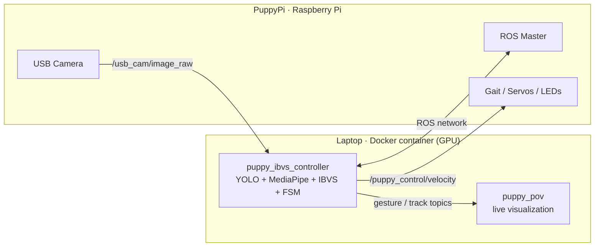
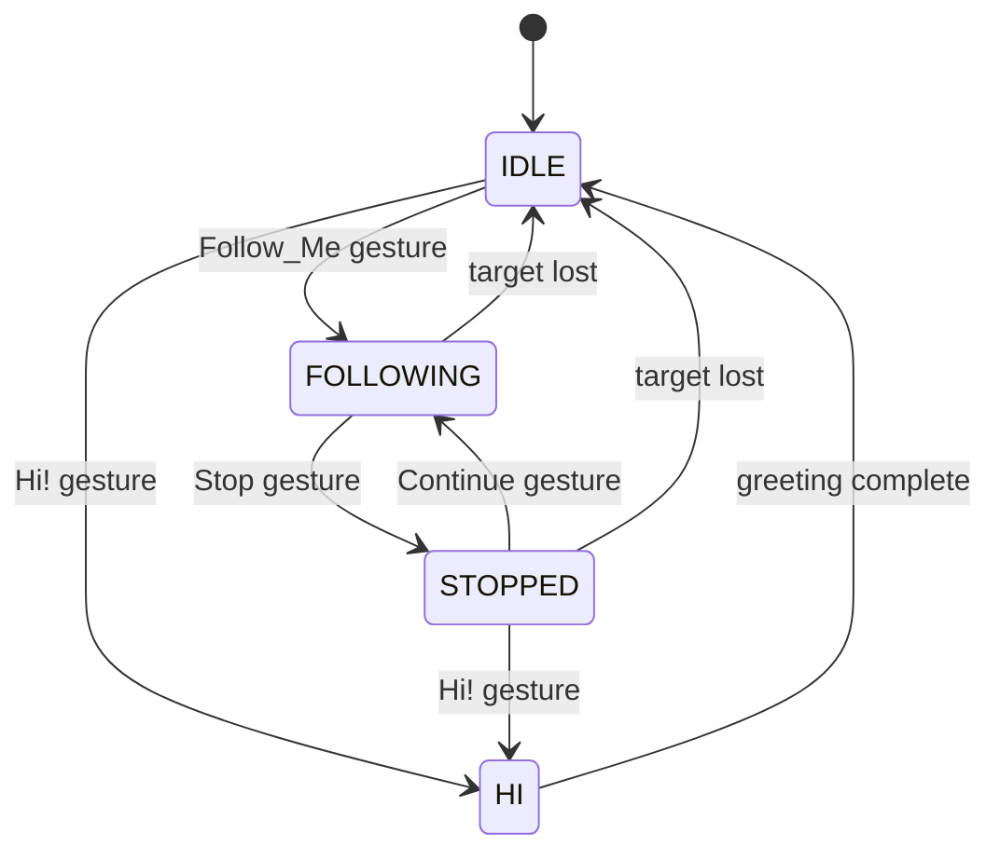

# 🐕 PuppyPi — Gesture-Controlled Person Follower

> A real-time person-following system for the **PuppyPi quadruped robot**, combining YOLOv8 detection and tracking, MediaPipe-based hand-gesture recognition, and an **Image-Based Visual Servoing (IBVS)** controller driven by a gesture-triggered finite state machine. The vision/ML stack runs in a GPU-accelerated **Docker container** that joins the robot's ROS network as a remote node.


## 🎥 Demo

<!-- A short GIF here makes the strongest impression. Replace the link below. -->
[▶️ Watch the demo video](https://drive.google.com/file/d/1aVHMVi_uXwLiOWfDmDQKc18NiFWPaZrG/view?usp=drive_link)

## ✨ Highlights

| Metric | Result |
|---|---|
| Real-time performance | **22 FPS** (favorable lighting) |
| Person detection (YOLOv8) | **86% accuracy** — `person` class, COCO 2017 |
| Gesture classifier | **93% accuracy** across **4 command gestures** |
| Reliable following range | **3–5 m** |

## 🧠 Key Features

- **Image-Based Visual Servoing (IBVS):** a proportional control law tracks the target by minimizing the horizontal error (person centroid vs. frame center) and a distance error estimated from bounding-box height via a **pinhole camera model**.
- **Smooth, safe motion:** velocity commands pass through **dead-bands**, **saturation limits**, and a custom **slew-rate limiter** to prevent abrupt movements.
- **Gesture-driven finite state machine:** four states (`IDLE → FOLLOWING → STOPPED → HI`) switched by hand gestures.
- **Calibrated vision:** frames are undistorted with the camera's intrinsic parameters (obtained via OpenCV camera calibration).
- **Distributed ROS architecture:** the robot hosts the ROS master; the laptop runs the heavy ML pipeline inside a containerized, GPU-enabled remote node.

## 🏗️ System Architecture

The **PuppyPi (Raspberry Pi)** runs the ROS master and exposes the camera feed and motion services. The **laptop** runs the perception and control pipeline inside a Docker container that connects to the robot's ROS master over the network and streams velocity commands back.



### Why Docker?

The robot runs **ROS Noetic on Python 3.8**, but the GPU-accelerated ML stack (PyTorch, TensorFlow, YOLOv8, MediaPipe, ONNX Runtime) must be ABI-compatible with that exact runtime. The container reproduces a matched environment on the laptop — **Ubuntu 20.04 + CUDA 11.8 + cuDNN 8 + Python 3.8 + ROS Noetic** — so the laptop can join the robot's ROS network as a remote node while still using its own GPU. This sidesteps the Python/CUDA version conflicts between the Raspberry Pi and the host machine.

## 🤖 State Machine



## 🧩 Components

**ROS nodes** (run inside the container):
- **`puppy_ibvs_controller.py`** — the core node. Subscribes to the robot's compressed camera stream and runs YOLOv8 (ONNX) + BoT-SORT for person detection/tracking, MediaPipe HandLandmarker for landmark extraction, and a sliding-window gesture classifier. It computes IBVS velocity commands, manages the state machine, and publishes velocity, LED state, and tracking/gesture topics.
- **`puppy_pov.py`** — visualization node. Renders the robot's point of view with bounding boxes, hand landmarks, gesture labels, per-state colors, and FPS; sends a shutdown signal on `ESC`.

**Python modules** (shared logic):
- **`puppy_frame_processing.py`** — camera parameter loading, undistortion maps, person tracking, crop/landmark helpers, and drawing utilities.
- **`puppy_command.py`** — robot command helpers (velocity publishing, action groups, LED state colors) and the gesture model + sliding-window classifier.

## 🛠️ Tech Stack

`Python` · `ROS Noetic` · `Docker` · `CUDA 11.8 / cuDNN 8` · `YOLOv8 (ONNX Runtime)` · `BoT-SORT` · `MediaPipe` · `TensorFlow/Keras` · `PyTorch` · `OpenCV` · `NumPy`

## 📁 Project Structure

```
puppypi-person-follower/
├── Dockerfile
├── entrypoint.sh                 # Sources ROS, launches both nodes
├── run.sh                        # Detects IPs, runs the GPU container
├── scripts/
│   ├── puppypi_system/
│   │   ├── puppy_ibvs_controller.py
│   │   └── puppy_pov.py
│   ├── puppy_frame_processing.py
│   ├── puppy_command.py
│   └── camera_calibration/
│       └── camera_params.npz     # Camera intrinsics (mounted at runtime)
├── ros_msgs/                     # Mirror message/service packages
│   ├── puppy_control/
│   └── sensor/
├── models/                       # ML models (mounted at runtime — see below)
└── README.md
```

## 🚀 Getting Started

### Prerequisites
- An **NVIDIA GPU** with recent drivers + the **NVIDIA Container Toolkit** (for `--gpus all`).
- **Docker** installed (`curl -fsSL https://get.docker.com | sh`).
- A **PuppyPi** robot reachable on the same network, running its ROS master.

### 1. Build the image
```bash
docker build -t puppypi_follower .
```

### 2. Run
```bash
# Pass the robot's IP address as the only argument
./run.sh <PUPPYPI_IP>
# Example:
./run.sh 192.168.100.166
```
`run.sh` auto-detects the laptop IP, configures `ROS_MASTER_URI` / `ROS_IP`, enables X11 forwarding for the visualization window, and mounts the GPU, `models/`, and the camera calibration file into the container.

### Controlling the robot
| Gesture | Action |
|---|---|
| **Follow_Me** | Start following the person who signaled |
| **Stop** | Pause and hold position |
| **Continue** | Resume following |
| **Hi!** | Turn toward the person and greet |

## 📦 Models

The ML models are **not tracked in this repository** (large binaries) and are mounted at runtime under `models/`:

```
models/
├── hand_landmarker.task
├── person_detector/v4_cleanned_data_small/weights/best.onnx
├── gesture_classifier/
│   ├── gesture_weights_v3.npz
│   └── gesture_classes.json
└── camera_params.npz
```
<!-- Optional: link to a GitHub Release or external storage where the weights can be downloaded. -->

## 👤 Author

**Jonathan Piña** — Robotics & AI Engineer
[LinkedIn](https://www.linkedin.com/in/jonathan-po/) · jonas.orlaineta02@gmail.com
